<div align="center">

<!-- Dynamic Header with Animated Wave -->


</div>

<h3 align="center">
  <samp>
    Full-Stack Developer | UX/UI Designer | Photographer
  </samp>
</h3>

<p align="center">
  <a href="https://visuxlize.github.io/portfolio/" target="_blank">
    
  </a>
  <a href="https://www.linkedin.com/in/andres-marte-95438217b/" target="_blank">
    
  </a>
  <a href="mailto:mAndres1994@gmail.com">
    
  </a>
  <a href="http://www.instagram.com/visuxlize_" target="_blank">
    
  </a>
</p>

<div align="center">
  
</div>

<br/>

---


###  About Me

```javascript
const andres = {
    pronouns: "He/Him",
    location: "New York, NY 🗽",
    timezone: "EST (UTC-5)",
    currentRole: "Software Development Student",
    university: "DeVry University",
    
    background: {
        education: ["B-Tech in Architecture", "UX/UI Design Certificate"],
        transition: "Architecture → Software Development",
        passions: ["Problem Solving", "User Experience", "Visual Design"]
    },
    
    interests: [
        "Full-Stack Web Development",
        "UI/UX Design & Research",
        "Database Architecture",
        "Photography (Portraits, Urban, Weddings)"
    ],
    
    currentlyLearning: [
        "Advanced React Patterns",
        "Cloud Computing (AWS, Azure)",
        "Database Systems & SQL",
        "Mobile App Development"
    ],
    
    funFact: "I photograph New York City streets and weddings when I'm not coding! 📸",
    
    lookingFor: "Collaboration on projects that challenge me and expand my skillset",
    
    availability: "Open to internships and junior developer opportunities"
};
```

<br clear="both"/>

---

### 🛠️ Technology Stack

<details open>
<summary><b>💻 Programming Languages</b></summary>
<br>

<p align="center">
  
  
  
  
  
  
  
</p>

</details>

<details open>
<summary><b>⚡ Frameworks & Libraries</b></summary>
<br>

<p align="center">
  
  
  
  
  
  
</p>

</details>

<details open>
<summary><b>🎨 Design & Creative Tools</b></summary>
<br>

<p align="center">
  
  
  
  
  
  
</p>

</details>

<details open>
<summary><b>🔧 Development Tools</b></summary>
<br>

<p align="center">
  
  
  
  
  
  
</p>

</details>

---

### 📊 GitHub Analytics

<div align="center">
  
  
</div>

<div align="center">
  
</div>

---

### 🚀 Featured Projects

<table align="center">
<tr>
<td width="50%" valign="top">

#### 🧠 [Therapick App](https://github.com/visuxlize/therapick-app)
  
**A stress-free therapist search application**

Matches users with mental health professionals based on their current emotional state, eliminating the overwhelm of searching through countless directories.

**Tech Stack:**
- JavaScript
- React
- User-centric design

**Key Features:**
- Emotion-based matching algorithm
- Simplified therapist discovery
- Focus on reducing user anxiety

[](https://github.com/visuxlize/therapick-app)

</td>
<td width="50%" valign="top">

#### 🏢 [NCM Redesign](https://github.com/visuxlize/NCMRedesign)

**Modern website redesign project**

Complete redesign of the New Castle Metal website, focusing on improved user experience and modern web standards.

**Tech Stack:**
- JavaScript
- Modern CSS
- Responsive design

**Key Features:**
- Enhanced visual hierarchy
- Improved navigation
- Mobile-first approach

[](https://github.com/visuxlize/NCMRedesign)

</td>
</tr>
<tr>
<td width="50%" valign="top">

#### 💼 [Portfolio Website](https://github.com/visuxlize/portfolio)

**Personal portfolio & showcase**

My personal portfolio website showcasing projects, skills, and professional journey from architecture to software development.

**Tech Stack:**
- TypeScript
- Modern frameworks
- Responsive design

**Key Features:**
- Project showcase
- Professional branding
- Interactive UI

[](https://visuxlize.github.io/portfolio/)

</td>
<td width="50%" valign="top">

#### ✂️ [Headz Ain't Ready](https://github.com/visuxlize/Headz-Aint-Ready)

**Full-stack barbershop site & staff dashboard**

A modern redesign for a Queens, NYC barbershop: public site, online booking (pick barber, service, date, time), and staff-only dashboard with schedule view, walk-ins, and calendar export.

**Tech Stack:**
- Next.js 15 (App Router)
- TypeScript
- Supabase (PostgreSQL + Auth)
- Drizzle ORM
- Tailwind CSS

**Key Features:**
- Real booking flow with availability & time-off
- Staff allowlist & dashboard (schedule, reschedule/cancel, ICS export)
- Deployed on Netlify with API routes & DB

[](https://github.com/visuxlize/Headz-Aint-Ready) [](https://headz-aint-ready.netlify.app/)

</td>
</tr>
</table>

---

### 🎯 Current Focus

```mermaid
graph LR
    A[🎓 Completing Degree] --> B[💼 Building Portfolio]
    B --> C[🚀 Job Ready]
    A --> D[📚 Learning Cloud]
    D --> C
    A --> E[🗄️ Mastering Databases]
    E --> C
    style A fill:#58a6ff
    style C fill:#1f6feb
```



**Primary Goals for 2026:**
- ✅ Complete Software Development degree at DeVry University
- 🎯 Build 3+ production-ready full-stack applications
- 📖 Master AWS/Azure cloud services
- 💼 Secure junior developer position in NYC
- 🤝 Contribute to open-source projects

---

### 💡 What Sets Me Apart

<table>
<tr>
<td>

**🏛️ Architectural Background**
- Unique perspective on system design
- Strong spatial and visual thinking
- Experience with complex project planning

</td>
<td>

**🎨 Design-First Mindset**
- UX/UI Design Certificate
- User-centered development approach
- Proficient in Adobe Creative Suite

</td>
<td>

**📸 Creative Eye**
- Professional photographer
- Attention to visual detail
- Understanding of composition & aesthetics

</td>
</tr>
</table>

---

### 📈 Contribution Graph

<div align="center">
  


</div>

---

### 🎓 Education & Certifications

```
🎓 Software Development (In Progress)
   DeVry University | Expected Graduation: 2025

🏗️ B-Tech in Architecture
   Completed

🎨 UX/UI Design Certificate
   Completed
```

---

### 📫 Let's Connect

<p align="center">
I'm always open to interesting conversations and collaboration opportunities!
</p>

<p align="center">
  <a href="https://visuxlize.github.io/portfolio/">
    
  </a>
  <a href="mailto:mAndres1994@gmail.com">
    
  </a>
  <a href="https://www.linkedin.com/in/andres-marte-95438217b/">
    
  </a>
  <a href="http://www.instagram.com/visuxlize_">
    
  </a>
</p>

---

### 💭 Quote of the Day

<div align="center">
  


</div>

---

<div align="center">

### ⚡ Fun Facts About Me

🏙️ **New York Native** | 📸 **Wedding & Urban Photographer** | 🏛️ **Former Architect** | ☕ **Coffee Enthusiast**

</div>

---

<div align="center">


**Thanks for visiting! Feel free to explore my repositories and reach out!** 


</div>
